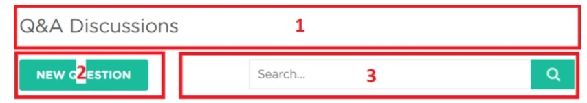

# React 🚀️

## ¿Qué es el desarrollo Front-End?

Se refiere al desarrollo de lo que el usuario final (cliente) va a ver. Consiste, básicamente, en HTML, CSS y JS. Como desarrolladores, somos consientes que a medida que las paginas van creciendo, se van haciendo cada vez mas complejas, y para manejar estas necesidades, se crearon librerías como React.

React fue creada por Facebook en 2013.

## ¿Porque React?

**Velocidad**

Las web interactivas necesitan actualizar el DOM casi siempre cada vez que cambia algo, React usa un **DOM Virtual** que permite hacer el update solo en las partes de la web que son necesarias. Esto aumenta mucho la velocidad de actualización.

**Fácil de usar**

Hace que mantener aplicaciones complejas sea mucho mas fácil.

**Support**

Hay mucha comunidad atrás de este lenguaje. Esta mantenido por Facebook y su comunidad.

# Getting Started ❤️ 

## Agregar React al HTML

Primero, tenemos que agregar a React en la etiqueta `<head>` de nuestro HTML.

```html
<script src="https://unpkg.com/react@16/umd/react.development.js" crossorigin></script>

 <script src="https://unpkg.com/react-dom@16/umd/react-dom.development.js" crossorigin></script>
```

También tenemos que agregar otro Script para permitir el **uso de JSX** , esta es una extensión de JS.

```html
<script src="https://unpkg.com/babel-standalone@6/babel.min.js"></script>
```

Creamos el container `<div id="container"></div>` y mostramos el primer mensaje hecho con React

```javascript
<script type="text/babel">
ReactDOM.render(
  <h1>Hello, React!</h1>,
  document.getElementById('container')
) 
</script>
```

Este Script busca el div con el ID 'Container' y le agrega el `<h1>`

## Crear una Aplicación React

En este caso, vamos a necesitar Node para crear un proyecto React. Vamos a crear una aplicación llamada "my-app"

```
npx create-react-app my-app
cd my-app
npm start
```

## Estructura del proyecto

* public -> Contiene todo lo que la aplicacion va a mostrar al cliente, como el `index.html` que es el template de nuestra pagina.
* src -> Contiene todo el JS, CSS e imagenes que van a ser compilados en el `index.html`

**¿Cómo se compila todo dentro de un solo archivo bundle?**
Se usa un **File Loader**. En el caso de React, se usa **Webpack**, crea un bundle que contiene a todos los archivos que necesitan ser "bundleados", creando un solo HTML con todo.

* index.js -> Es el entrypoint de la aplicacion, tiene un metodo llamado `ReactDOM.render()` que busca al elemento cuyo id es "root" en el HTML e inserta todo el contenido ahi.
* App.js -> Es el componente main de la aplicacion que sera renderizado en el DOM.

Para cambiar el texto que nos viene de bienvenida al crear el proyecto, tenemos que ir al archivo `src/index.js`, por ejemplo, con lo siguiente ->

```javascript
ReactDOM.render(
  <h1>Hello, React!</h1>,
  document.getElementById('root')
);
```

# JSX ❤️

## ¿Qué es JSX?

Es una extension de Javascript que nos permite construir elementos de la UI usando codigo HTML pero en el medio del JS. No es obligatorio usarlo, pero si muy comun.
Por ejemplo ->

```
ReactDOM.render(
  <h1>Hello, React!</h1>,
  document.getElementById('root')
);
```

Esta porcion de codigo llamada al metodo `Render` de React, y le pasa dos argumentos, el elemento HTML que queremos renderizar y el container del mismo (El elemento cuyo id es root).
Tambien nos podemos manejar con variables como en el siguiente ejemplo:

```
const name = "David";
const el = <p>Hello, **{name}**</p>;

ReactDOM.render(
  el,
  document.getElementById('root')
);
```

## Atributos en JSX

Podemos usar como atributos de un HTML nombres entre comillas como `<div id="container"></div>` o usar una expresion JS `<div id={user.id}></div>`

## ¿Cómo funciona?

Cuando las expresiones JSX con compiladas, se convierten en objetos JS, que representan elementos de React, y luego estos elementos son usados para constuir el DOM para luego, mostrarlo en el navegador.

Por ejemplo, hagamos un contador que incremente el valor de una variable por segundo, y esto representa un parrafo en la pagina:

```
let counter = 0;

function show() {
  counter++;
  const el = <p>{counter}</p>;
  ReactDOM.render(
    el, document.getElementById('root')
  );
}

setInterval(show, 1000);
```

Usamos el `setInterval` para llamar a la funcion `show()` que renderiza un elemento `<p>` en la pagina con el valor del contador, que se inicializa en cero. React, al solo actualizar lo necesario, no hace un parrafo nuevo por segundo, si no que actualiza el existente.

## Virtual DOM

Para que React pueda actualizar solo lo necesario de una pagina, se usa el **Virtual DOM** que es una representacion del DOM. Cuando un elemento cambia, primero se actualiza el VDOM, esto es un proceso muy rapido. Luego, React compara al VDOM con el estado anterior y solo aplica los cambios necesarios para que el DOM ya este en el estado actual.

# Componentes 👀️ 

Los componentes nos permiten separar la pagina en distintas partes reusables. Por ejemplo:



Cada parte numerada es un componente separado. Esto nos permite hacer **Separation of concerns**, un principio en programacion que dice que cada problema debe ser separado en piezas individuales.

## Componentes de Función

Es una funcion de JS

```
function Hello(){
return <h1>Hola</h1>;
}
```

* Los nombres de estos componentes deben empezar con mayuscula, de lo contrario, el navegador los va a tratar como elementos html.

**¿Cómo lo renderizo?**

Tenemos que crear el elemento JSX correspondiente
`const el = <Hello/>`

Ahora podemos usar nuestro componente y renderizarlo:

```
function Hello() {
  return <h1>Hello world.</h1>;
}

const el = <Hello />; 
ReactDOM.render(
  el, 
  document.getElementById('root')
);
```

## Componentes de clase

Son usados cuando hay interacciones con el usuario mas avanzadas, como formularios o animaciones.
Todos necesitan heredar de React.Component

```
class Hello extends React.Component {
  render() {
    return <h1>Hello world.</h1>;
  }
}
```

# Props 👀️

Los componentes de Funcion pueden aceptar argumentos, como las funciones de JS. A estas se le dicen `props` y representan a un objeto.
Por ejemplo, si queremos usar props en nuestro componente `Hello` ->

```
function Hello(props) {
  return <p>Hello, {props.name}!</p>;
}
```

Y asi, luego, se lo podemos mandar
`const el = <Hello name="David" />;`


